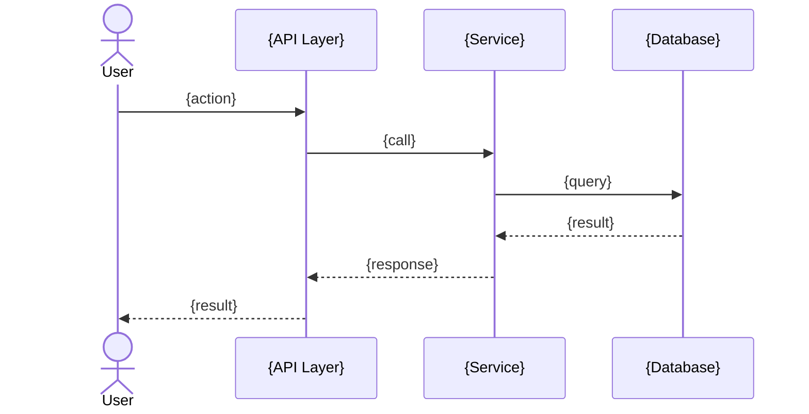
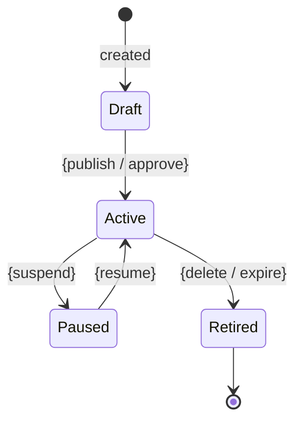
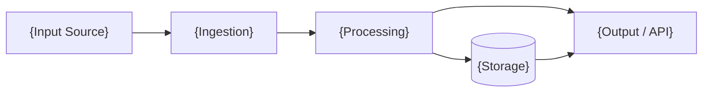

# {Product} Functional Processes

<!-- This document describes HOW the system behaves — not what components exist,
     but what they do. Every downstream document (API, Backend, Security) depends
     on this for understanding the system's operational flows. -->

## 1. Installation & Setup

### Prerequisites
<!-- What must exist before installation? -->

### Installation Flow
<!-- Step-by-step: download → verify → configure → initialize → validate -->

### First-Run Experience
<!-- What happens when the system starts for the first time? -->

---

## 2. Configuration

### Configuration Sources
<!-- Where does config come from? (file, env vars, CLI flags, API) Priority order? -->

### Configuration Schema
<!-- Key configuration sections with defaults and descriptions -->

| Key | Type | Default | Description |
|-----|------|---------|-------------|
| {key} | {type} | {default} | {description} |

### Configuration Validation
<!-- What happens with invalid config? When is config validated? -->

---

## 3. Core Processes

<!-- The primary operational flows. Each process should describe:
     - Trigger: what starts it
     - Flow: step-by-step sequence
     - State transitions: if applicable
     - Error handling: what happens when things go wrong
     - Output: what it produces -->

### Process 1: {Name}

**Trigger:** {what starts this process}

**Flow:**
1. {step}
2. {step}
3. {step}

<!-- [T2+] Sequence diagram showing actor interactions for this process: -->



**State Transitions:**
<!-- [T2+] State machine diagram if applicable -->

```mermaid
stateDiagram-v2
    [*] --> {InitialState}
    {InitialState} --> {ActiveState}: {trigger}
    {ActiveState} --> {CompletedState}: {trigger}
    {ActiveState} --> {ErrorState}: {failure condition}
    {ErrorState} --> {ActiveState}: {retry}
    {CompletedState} --> [*]
```

**Error Handling:**
<!-- What happens on failure? Retry? Escalate? Fail-closed? -->

<!-- Repeat for each core process -->

---

## 4. Lifecycle Management

<!-- [T2+] How are the system's managed entities created, updated, and removed? -->

### Entity Lifecycle: {Name}
**States:** {draft → active → paused → retired}
**Transitions:** {what triggers each transition}



---

## 5. Scheduled Operations

<!-- [T2+] What happens on a schedule? (maintenance, cleanup, sync, reporting) -->

| Schedule | Operation | Description |
|----------|-----------|-------------|
| {cron/interval} | {name} | {what it does} |

---

## 6. Data Flows

<!-- [T3] How data moves through the system. Input → processing → output → storage. -->



<!-- Repeat or expand for each major data flow. Show transformations, validation points, and where data is persisted. -->

---

<!-- TIER GUIDANCE:
T1: Sections 1-3 only (if optional doc is included).
T2: Sections 1-5 required.
T3: All sections required. Expand §3 with detailed state machines.
-->
