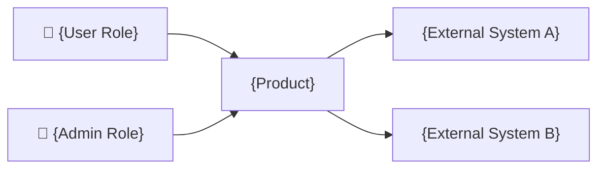
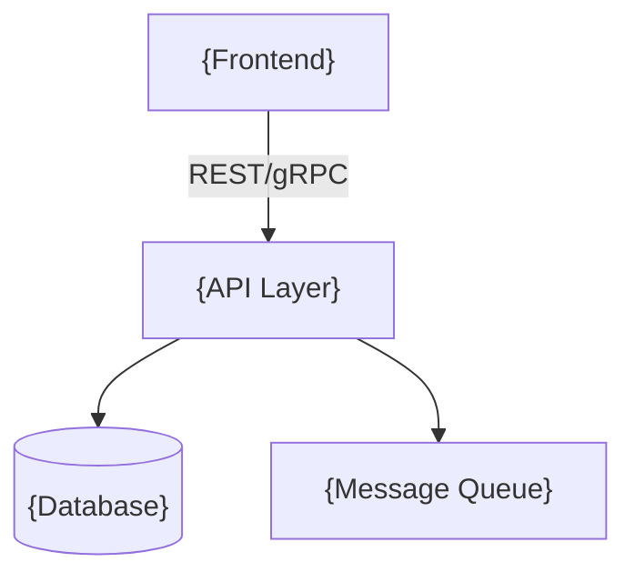
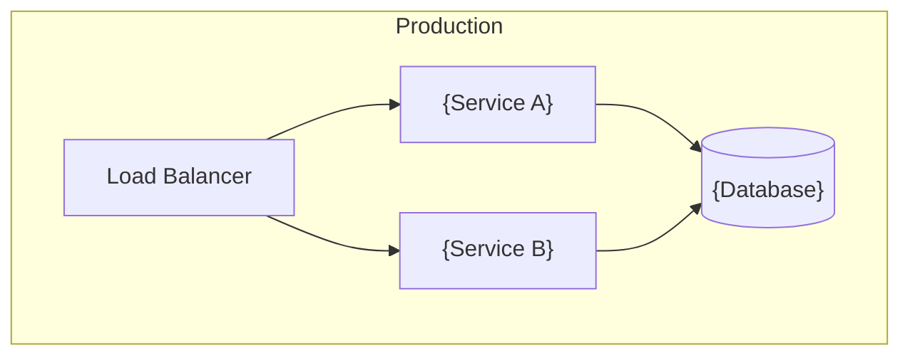

# {Product} Architecture

## 1. Product Identity

<!-- What is this product? One paragraph. -->

**Name:** {Product}
**Tagline:** {One sentence value proposition}
**Target Users:** {Who uses it and who buys it}

### Problem Statement
<!-- What problem does this solve? Why do existing solutions fall short? -->

### Product Vision
<!-- Where is this product going? What does success look like in 2 years? -->

---

## 2. Stakeholders

<!-- [T2+] Who has a stake in this product's architecture? This determines who reviews which documents. -->

| Role | Key Concern | Reviews |
|------|------------|---------|
| {e.g., Product Owner} | {e.g., feature completeness, time to market} | {e.g., Root Architecture, Functional Processes} |
| {e.g., Security Lead} | {e.g., threat surface, compliance} | {e.g., Security Architecture, API Spec} |
| {e.g., End User} | {e.g., usability, performance} | {e.g., UI Design} |

---

## 3. Architecture Overview

<!-- High-level view of the system's major pieces and how they connect. -->

### System Context

<!-- [T2+] The system boundary: users on one side, external systems on the other. -->

### Components

| Component | Responsibility | Deployment |
|-----------|---------------|------------|
| {name} | {what it does} | {how it runs} |

### Component Interaction

<!-- How do components communicate? (HTTP, gRPC, IPC, message queue, shared DB) -->

---

## 4. Deployment Model

<!-- How is this deployed? Single binary? Multiple services? Container? -->

**Primary:** {e.g., single binary, Docker container, Kubernetes}
**Development:** {e.g., local binary, docker-compose}

### Deployment Topology
<!-- [T2+] How components map to infrastructure. -->

### Scaling Strategy
<!-- [T3] How does deployment evolve? (single node → modular → distributed) -->

---

## 5. Technology Stack

| Layer | Technology | Rationale |
|-------|-----------|-----------|
| Backend | {language/framework} | {why} |
| Frontend | {framework} | {why} |
| Database | {engine} | {why} |
| {other} | {tool} | {why} |

---

## 6. Architecture Principles

<!-- [T2+] Enduring rules that guide decisions. These don't change per-decision — they shape HOW decisions are made. 3-5 principles is typical. -->

| Principle | Rationale |
|-----------|-----------|
| {e.g., Single binary deployment} | {e.g., Reduces operational complexity — one artifact to build, ship, monitor} |
| {e.g., Offline-first data model} | {e.g., Users in field environments can't guarantee connectivity} |
| {e.g., Fail-closed on security decisions} | {e.g., Regulatory environment — better to deny than to allow unauthorized access} |

---

## 7. Key Architectural Decisions

<!-- Major decisions that shape the system. Each should have rationale. Reference Decision Log entries where applicable. -->

### Decision 1: {Title}
**Choice:** {what was decided}
**Rationale:** {why}
**Alternatives considered:** {what was rejected and why}

<!-- Repeat for each major decision. -->

---

## 8. Quality Attributes

<!-- Top 3-5 quality goals that drive architectural trade-offs. These are measurable targets, not aspirations. -->

| Attribute | Target | Priority |
|-----------|--------|:--------:|
| {e.g., Latency} | {e.g., API p95 < 200ms} | {1} |
| {e.g., Availability} | {e.g., 99.9% uptime} | {2} |
| {e.g., Security} | {e.g., Zero PII exposure} | {3} |

<!-- If two attributes conflict, priority determines which wins. Document the trade-off in Key Architectural Decisions. -->

---

## 9. Data Model Overview

<!-- [T2+] High-level entities and relationships. Not full schema — that's in Backend Architecture. -->

| Entity | Description | Key Relationships |
|--------|-------------|-------------------|
| {name} | {what it represents} | {relates to...} |

---

## 10. Security Model

<!-- [T2+] High-level security posture. Full detail in Security Architecture. -->

**Authentication:** {method}
**Authorization:** {model — RBAC, ABAC, etc.}
**Data Protection:** {encryption strategy}

---

## 11. Cross-Cutting Concerns

<!-- [T2+] Patterns and policies that apply across the entire system. This table becomes a G5 consistency checklist — each concern must be consistently applied in every document that references it. -->

| Concern | Defined In | Enforced By |
|---------|-----------|-------------|
| {e.g., Error handling} | {e.g., Backend Architecture §7} | {e.g., API Spec error responses, Frontend error boundaries} |
| {e.g., Logging format} | {e.g., Operational §2} | {e.g., Backend Architecture, all services} |
| {e.g., Auth enforcement} | {e.g., Security Architecture §4-5} | {e.g., API middleware, Frontend route guards} |
| {e.g., Design tokens} | {e.g., UI Design §tokens} | {e.g., Frontend Architecture CSS variables} |

---

## 12. Integration Points

<!-- [T2+] External systems this product connects to. -->

| System | Protocol | Purpose | Data Exchanged |
|--------|----------|---------|---------------|
| {name} | {REST/gRPC/SMTP/etc.} | {what it does} | {what flows in/out} |

---

## 13. Release Roadmap

| Version | Scope | Key Features |
|---------|-------|-------------|
| v1.0 | {scope} | {features} |
| v1.1 | {scope} | {features} |

---

## 14. Constraints & Assumptions

<!-- What constraints shape this architecture? What assumptions are we making? -->

### Constraints
- {constraint with rationale}

### Assumptions
- {assumption — document so it can be validated}

---

## 15. Risks & Technical Debt

<!-- [T2+] Known architectural risks and intentional shortcuts. Track them here so they don't get forgotten. -->

| Risk | Impact | Mitigation | Owner |
|------|--------|-----------|-------|
| {e.g., Single DB is scalability ceiling} | {e.g., Limits to ~10K concurrent users} | {e.g., Schema designed for future sharding} | {e.g., Backend lead} |
| {e.g., Vendor lock-in on auth provider} | {e.g., Migration cost if provider changes pricing} | {e.g., Abstract behind interface} | {e.g., Security lead} |

### Technical Debt
<!-- Intentional shortcuts taken for speed. Each should have a plan to resolve. -->

- {shortcut}: {why it was taken} → {when/how to fix}

---

<!-- TIER GUIDANCE:
T1 (Utility): Sections 1, 3, 5, 7, 8 required. Others optional.
T2 (Application): Sections 1-12, 14 required. 13, 15 recommended.
T3 (Platform): All sections required. Add subsections as needed.
-->
